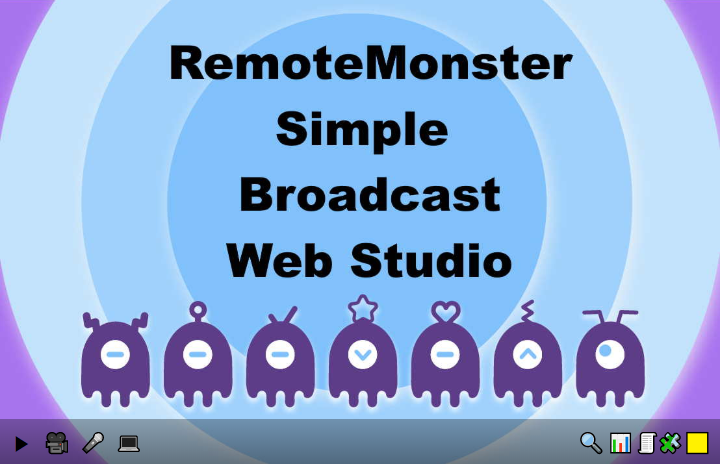

# RemonShow - Simple HTML5 Video Studio

[![NPM][npm-icon]][npm-link]

> RemonShow is a web video studio built from the ground up for an HTML5 world. It support HTML5 and RemoteMonster SDK. It supports input devices control and many constraints on desktops and mobile devices. With RemonShow, You can make a live streaming service with *WebRTC* very easy.


## Table of Contents
* [Quick Start](#quick-start)
* [Parameters](#parameters)
* [License](#license)

## Quick Start
Add these tags to your document's `<head>`:

```html
<script src="@remotemonster/RemonShow-mini.min.js"></script>
```

## License

RemonShow is licensed under the MIT.